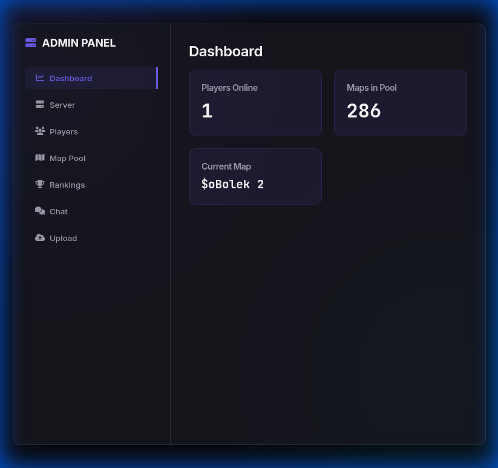

# ManiaPlanet Admin Panel Modernized

A sleek, modern, and powerful web-based admin panel for ManiaPlanet game servers (Stadium).



## Features

- 🌑 **Modern UI:** Dark theme with glassmorphism and neon accents.
- 📊 **Real-time Dashboard:** Live overview of server status, map info, and players.
- 🏎️ **Map Management:** Drag-and-drop map uploads, pool shuffling, and removal.
- 👥 **Player Controls:** Kick, Ban, Mute, or Spectate players directly from the UI.
- 🕒 **Live Rankings:** Real-time session rankings with accurate best times.
- 💬 **Integrated Chat:** Full server chat integration with support for ManiaPlanet color codes.
- 🔄 **Server Restart:** Restart the game server via configurable restart.sh script.

## Tech Stack

- **Backend:** Node.js, Express, `gbxremote` (XML-RPC).
- **Frontend:** Vanilla HTML5, CSS3, ES6 JavaScript.

## Getting Started

### Prerequisites

- Node.js 20+
- A running ManiaPlanet 4 Stadium server with XML-RPC enabled (Port 5000).

### Installation

1. Clone the repository:
   ```bash
   git clone https://github.com/LukasRat/maniaplanet-admin-panel.git
   cd maniaplanet-admin-panel
   ```

2. **Install dependencies** (⚠️ Required - do not skip this step):
   ```bash
   npm install
   ```
   > **Note:** This installs Express, gbxremote, and other required packages. If you skip this step, you'll get "Cannot find module 'express'" errors.

3. **Configure your server** - Edit `server.js` and update the constants at the top:
   
   **RPC Connection Settings:**
   ```javascript
   const RPC_HOST = '127.0.0.1';
   const RPC_PORT = 5000;
   const RPC_LOGIN = 'SuperAdmin';
   ```
   
   **Maps Directory (Optional - for local cache):**
   ```javascript
   const MAPS_DIR = process.env.MANIAPLANET_MAPS_DIR || path.join(__dirname, 'UserData', 'Maps')
   ```
   
   The `MAPS_DIR` is used as a local cache for uploaded maps. Maps are automatically uploaded to the Maniaplanet server via the WriteFile RPC method, so you don't need to configure this unless you want to change the local storage location.

4. Start the panel:
   ```bash
   npm start
   ```

5. Access the panel:
   Open `http://localhost:3100` in your browser and enter your ManiaPlanet server password to login.

### Configuring Server Restart (Required for Restart Button)

⚠️ **IMPORTANT**: The "Restart Server" button will NOT work until you configure `restart.sh` for your specific server setup!

The admin panel includes a server restart feature that uses the `restart.sh` script. **By default, this script is NOT configured and will fail.** You must edit it to match your server installation.

#### Quick Setup

1. **Open the restart.sh file:**
   ```bash
   nano restart.sh
   ```

2. **Find the method that matches your setup and uncomment it:**

   **If you use systemd (most common):**
   ```bash
   # Uncomment this line (remove the #):
   sudo systemctl restart maniaplanet-server
   ```

   **If you use screen/tmux:**
   ```bash
   # Uncomment and configure these lines:
   SCREEN_NAME="maniaplanet"
   screen -S "$SCREEN_NAME" -X quit
   sleep 2
   screen -dmS "$SCREEN_NAME" /path/to/ManiaPlanetServer /dedicated_cfg=your_config.txt
   ```

   **If you use Docker:**
   ```bash
   # Uncomment and configure:
   CONTAINER_NAME="maniaplanet-server"
   docker restart "$CONTAINER_NAME"
   ```

   **If you have a custom script:**
   ```bash
   # Add your restart command in Method 6:
   /path/to/your/restart_script.sh
   exit 0
   ```

3. **Make the script executable:**
   ```bash
   chmod +x restart.sh
   ```

4. **Test the script manually** before using it through the UI:
   ```bash
   ./restart.sh
   ```
   
   If you see "ERROR: No restart method configured!", you need to uncomment one of the methods in the script.

5. **Test through the admin panel** - Click "Restart Server" and check:
   - The server console for script output
   - Whether your ManiaPlanet server actually restarts
   - If it fails, check the browser console (F12) for error details

#### Common Issues

- **"Only npm gets stopped"** - The script isn't configured. Edit restart.sh and uncomment your restart method.
- **Permission denied** - The script may need sudo. Either configure passwordless sudo or add `sudo` before the restart command.
- **Script not found** - Make sure restart.sh is in the same directory as server.js and is executable.

**Note:** The admin panel (Node.js) runs separately from your ManiaPlanet game server. This script restarts the **game server**, not the admin panel.

## Troubleshooting

### Map Upload Not Working

If map uploads fail or show "0 maps uploaded":

1. **Check RPC connection**:
   - Ensure the ManiaPlanet server is running with XML-RPC enabled
   - Verify `RPC_HOST` and `RPC_PORT` are correct in `server.js`
   - Check that you've logged in with the correct SuperAdmin password

2. **Check error messages**:
   - Open browser console (F12) to see detailed error messages
   - Check server console for RPC error details
   - Common errors:
     - "Map unknown" - Usually means WriteFile failed (check RPC connection)
     - "Authentication failed" - Wrong password or RPC not enabled
     - "Connection refused" - Server not running or wrong port

3. **Verify map files**:
   - Files must have `.gbx` or `.Map.Gbx` extension (case-insensitive)
   - File size must be under 10MB (configurable in server.js)
   - Filenames should not contain path traversal attempts (`..`)

**How it works:**
- Maps are uploaded via the `WriteFile` RPC method directly to the server
- No filesystem access to the server is required
- Maps are also stored locally in `UserData/Maps` as a cache

### Error: Cannot find module 'express'

If you see this error when running `npm start`:
```
Error: Cannot find module 'express'
```

**Solution:** You need to install dependencies first:
```bash
npm install
```

This happens because `node_modules/` is not included in the repository (it's in `.gitignore`). You must run `npm install` to download all required packages before starting the server.

### Other Common Issues

- **Server won't connect:** Ensure your ManiaPlanet server is running with XML-RPC enabled on port 5000
- **Port 3100 already in use:** Change `HTTP_PORT` in `server.js` or stop the process using port 3100

## License

MIT


## Support 
[](https://ko-fi.com/P5P81TXQBY)